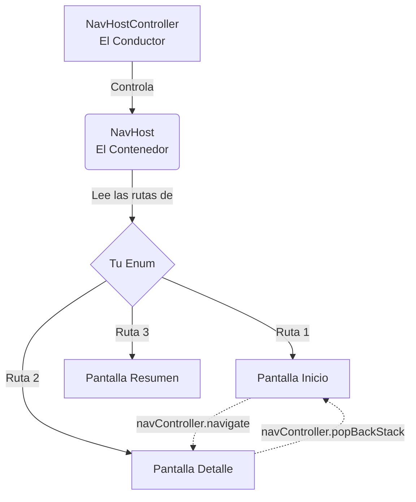

```mermaid
graph TD
    A[NavHostController\nEl Conductor] -->|Controla| B(NavHost\nEl Contenedor)
    B -->|Lee las rutas de| C{Tu Enum}
    C -->|Ruta 1| D[Pantalla Inicio]
    C -->|Ruta 2| E[Pantalla Detalle]
    C -->|Ruta 3| F[Pantalla Resumen]
    D -.->|navController.navigate| E
    E -.->|navController.popBackStack| D
```