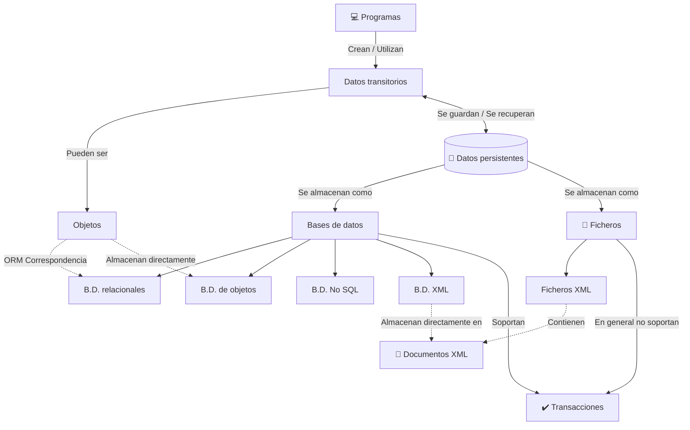

# 🗂️ Tema 01: Acceso a Datos - Introducción y Conceptos Básicos
> [!abstract] 📌 Concepto Clave: Persistencia de Datos
> La **persistència** es la capacidad de mantener datos de forma permanente en un dispositivo de almacenamiento secundario.
> * Consiste en la transmisión de datos desde la memoria principal hacia un medio de almacenamiento secundario.
> * El objetivo es que, más adelante, los datos se puedan recuperar de nuevo en la memoria principal.

## 🔄 Ciclo de Vida de los Datos

* 🧠 **Datos Transitorios:** Los programas informáticos solo pueden consultar los datos que se encuentran cargados en la memoria principal. Un programa puede crear datos en esta memoria. Si se recuperan datos del medio secundario a la memoria principal, vuelven a ser datos transitorios. Estos pueden ser consultados, modificados y volver a almacenarse.
* 💾 **Datos Persistentes:** Una vez que los datos transitorios se guardan en la memoria secundaria, se convierten en datos persistentes.

---

## 🗄️ Clases de Almacenamiento

| Característica | ⚡ Almacenamiento Primario (Memoria Principal) | 💾 Almacenamiento Secundario |
| :--- | :--- | :--- |
| **Función** | Donde se almacenan los datos con los que el programa trabaja en cada momento. | Donde se almacenan los datos de forma permanente (ej. discos duros, memorias flash). |
| **Volatilidad** | Sus contenidos se borran cuando se apaga el ordenador. | No se borran cuando se apaga el ordenador. |
| **Capacidad** | Tienen una capacidad relativamente baja. | Tienen una capacidad de almacenamiento relativamente alta. |
| **Velocidad** | El tiempo de acceso a los datos es relativamente corto. | - |
| **Tipo de datos**| Datos transitorios. | Datos persistentes. |

> [!info] 🌐 Arquitectura y Consideraciones del Almacenamiento Secundario
> * El almacenamiento secundario puede estar ubicado en un ordenador diferente al que ejecuta el programa.
> * Este ordenador distinto puede proporcionar servicios de persistencia a múltiples ordenadores a través de la red.
> * **Escalabilidad:** Es vital tener en cuenta las necesidades de almacenamiento futuras y la posibilidad de hacer frente a mayores cargas de trabajo y datos.
> * **Otros aspectos clave:** Son importantes la estandarización y el grado de consolidación o maduración de la tecnología.

---

## ⚙️ APIs y Transacciones

> [!tip] 🔌 API (Application Programming Interface)
> Interfaz de programación de aplicaciones.
> * Es un conjunto de funciones disponibles para que los programas las utilicen y accedan a determinados servicios.
> * Permite conectar la información o las funcionalidades con los requerimientos de una aplicación.
> * Gracias a esto, el cliente tiene acceso a toda su información requerida a través de una sola aplicación.

> [!warning] 🔒 Transacciones
> Una transacción es una secuencia de operaciones de consulta y modificación sobre datos persistentes.
> * Estas operaciones son realizadas por un programa como un "todo" (operaciones atomizadas).
> * Se ejecutan de manera aislada respecto a cualquier otra operación que cualquier otro programa pudiera intentar sobre los mismos datos.

---

## 🗺️ Mapa Conceptual: Estructura de Almacenamiento

## 🗃️ Bases de Datos vs Ficheros

### 🗄️ Bases de Datos

- 📊 **Base de datos relacional:** Representa los datos y sus relaciones utilizando tablas como estructuras básicas de almacenamiento, en consonancia con el modelo relacional .
    
    - _⚠️ Desfase Objeto-Relacional (ORM):_ Es el conjunto de dificultades que plantea intentar persistir objetos dentro de bases de datos relacionales .
        
- 📦 **Base de datos de objetos:** Almacena los objetos directamente, manteniendo la terminología propia de la programación orientada a objetos .
    
- 📝 **Base de datos XML:** Base de datos que almacena documentos en formato XML .
    
- 🔗 **Base de datos NoSQL:** Base de datos que no pertenece a ninguno de los tipos anteriores, y que normalmente basa su almacenamiento en escrituras .
    

### 📁 Ficheros (Archivos)

> [!quote] Definición 
> Un fichero es una secuencia de bytes almacenada en un medio de almacenamiento secundario . Se puede acceder a él indicando su nombre y su ubicación dentro de una jerarquía de directorios .

- Proporcionan una organización secuencial de los datos .
    
- Sobre los ficheros se puede representar cualquier clase de información .
    
- La información se almacena en una secuencia de registros de longitud fija, que a su vez están compuestos por campos de longitud fija .
    
- Se pueden crear **índices** (tantos como sean necesarios) para acelerar las consultas dentro del fichero secuencial .
    

#### 🔀 Modos de Acceso

- 🛤️ **Acceso secuencial:** Se leen los datos en orden, empezando desde el principio .
    
- 🎯 **Acceso aleatorio:** Permite saltar directamente a una posición concreta del fichero .
    

#### 🏷️ Tipos de Ficheros

- 📄 **Fichero de texto:** Contiene únicamente caracteres legibles (por ejemplo, `.txt`, `.CSV`) .
    
- 👾 **Fichero binario:** Puede contener cualquier tipo de datos en formato de bytes (por ejemplo, `.jpg`, `.exe`) .
    
- 🌍 **XML (eXtensible Markup Language):** Lenguaje que tiene una sintaxis muy sencilla y que permite representar cualquier clase de información .
    

## ☕ Trabajando con Archivos en Java

> [!example] Operaciones Básicas
> 
> 1. **Crear** archivos para almacenar información estructurada .
>     
> 2. **Leer** datos desde los archivos para procesarlos .
>     
> 3. **Escribir** información para actualizar archivos existentes .
>     
> 4. **Modificar** el contenido sin perder los datos que ya existían previamente .
>     

### 🛠️ Clases Básicas de Java

Para manejar persistencia en Java se emplean las siguientes clases principales:

|**Clase Java**|**Descripción / Uso**|
|---|---|
|`File`|Representa un camino (un fichero o un directorio) .|
|`FileReader` / `FileWriter`|Permiten trabajar con la lectura y escritura de ficheros .|
|`BufferedReader` / `BufferedWriter`|Mejoran la velocidad de acceso a los datos utilizando una memoria intermèdia .|
|`InputStream` / `OutputStream`|Permiten trabajar con flujos de entrada y salida .|
|`RandomAccessFile`|Permite leer y escribir en cualquier posición del archivo de forma aleatoria .|

### ⚠️ Gestión de Excepciones

Al manipular ficheros y realizar operaciones de lectura/escritura en Java, es obligatorio gestionar errores comunes mediante excepciones:

- 🛑 `IOException` .
    
- 🔍 `FileNotFoundException` .