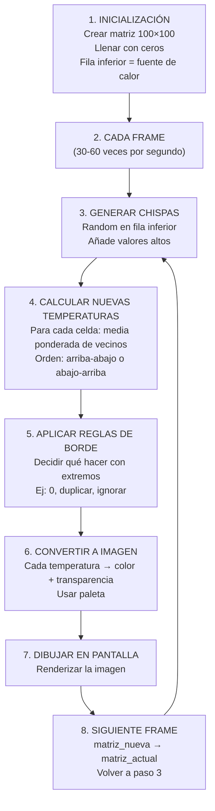
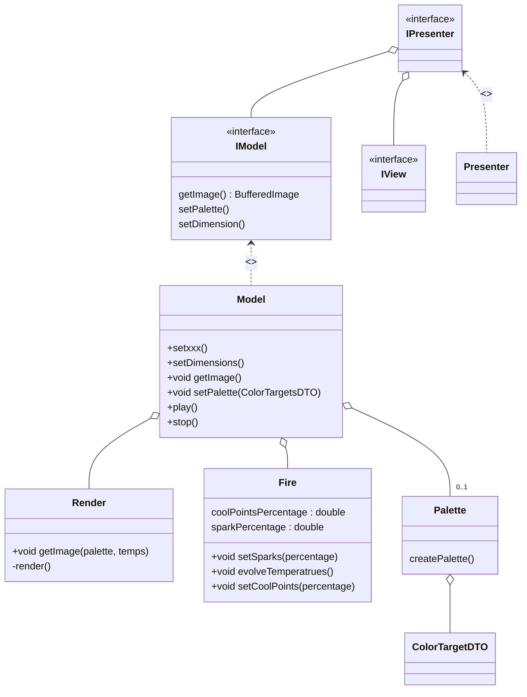

# T01 · Simulación de fuego mediante matriz de temperaturas

> [!summary] El tema en 3 líneas
> El fuego *no es una animación predefinida, sino un **modelo numérico* que se recalcula cada frame.
> Una *matriz 2D de temperaturas* almacena valores (0-255) que representan calor virtual. Cada frame, las temperaturas se actualizan usando las de *celdas vecinas* del frame anterior.
> Las temperaturas se convierten en *colores y transparencia*, creando una ilusión de fuego que varía según parámetros, generación aleatoria y fórmulas.

> [!info] Estado de la clase
> Esta explicación está *en desarrollo*. Jumi aún no ha terminado. Los detalles de la fórmula definitiva, ponderaciones y representación gráfica final se completarán en próximas clases.

---

## 🎯 Idea general

### ¿Qué NO es esta simulación?
- *No es una animación hecha a mano* donde cada frame está dibujado previamente.
- *No es un sprite que se mueve* o cambia de forma fija.
- *No es un efecto de partículas* tradicional (aunque parece fuego).

### ¿Qué es realmente?
Un *sistema de reglas numéricas* que:
1. Mantiene un *modelo interno* (matriz de números).
2. *Calcula cada frame* a partir del anterior usando esas reglas.
3. *Visualiza el resultado* transformando números en colores.
4. *Varía según parámetros y aleatoriedad*, así que cada ejecución puede ser diferente.

### Por qué es importante entenderlo
- Demuestra que *la mayoría de efectos visuales en videojuegos son cálculos numéricos*, no arte dibujado.
- Es un ejemplo de *física simplificada*: modelamos el calor sin necesidad de una simulación termodinámica real.
- Es *procedural*: generamos contenido nuevo en tiempo de ejecución según reglas, no desde datos pre-guardados.

---

## 📖 1. El modelo numérico: matriz de temperaturas

### 1.1 ¿Qué es la matriz?

Una *matriz bidimensional (2D)* es como una *tabla de filas y columnas*, donde cada celda contiene un número.

![[Pasted image 20261001120329.png]]


*En nuestro caso:*
- Cada celda [fila][columna] contiene un *número de 0 a 255* (temperatura).
- 0 = sin calor (frío, invisible).
- 255 = calor máximo (blanco o naranja intenso).
- 128 = calor medio (rojo/naranja).

### 1.2 Relación celda ↔️ píxel

*Punto crucial:* cada celda de la matriz se corresponde con *un píxel en pantalla* (o un bloque de píxeles si la matriz es muy pequeña).


Matriz de temperaturas        Imagen final (fuego visible)
    ↓                              ↓
[0,0]=100  [0,1]=80           🟠 🟠
[1,0]=50   [1,1]=120          🔴 🟡


Si la matriz es de *100×100, la imagen será de **100×100 píxeles* (o más, si escalas).

### 1.3 Estado inicial

*Al empezar:*
- Todas las celdas (excepto la fila inferior) tienen temperatura *0* (sin fuego).
- La fila inferior (la "base") es la *fuente de calor*:
  - Tiene valores *altos* (ej: 200-255).
  - *Simula el combustible ardiendo* en la parte baja.


![[Pasted image 20261001120357.png]]


### 1.4 Chispas aleatorias

En la fila inferior, se generan *"chispas"* de forma aleatoria:
- Una celda *puede recibir temperatura alta* (ej: 200).
- O *permanecer a 0*.
- El resultado es *impredecible, lo que hace que el fuego **no sea repetitivo*.

*Pseudocódigo:*
```java
para cada celda en la fila inferior:
    si random() < porcentaje_chispas:
        temperatura[fila_inferior][columna] = valor_aleatorio_alto
    sino:
        temperatura[fila_inferior][columna] = 0
```


---

## 📖 2. Funcionamiento del algoritmo: cálculo de frames

### 2.1 Premisa fundamental

*Cada nuevo frame NO se inventa de cero. Se calcula a partir del frame anterior.*

Esto es lo que diferencia una simulación de una animación. La temperatura de una celda depende de sus *vecinos* en el instante anterior:


Temperatura_nueva(x, y) = f( Temperaturas_vecinas_frame_anterior )


### 2.2 ¿Qué vecinos intervienen?

*Primera aproximación (simple):*

Imagina que quieres calcular la temperatura de la celda central. Miras a los *vecinos cercanos, especialmente los de **abajo*:


Matriz anterior (frame N):
         x-1   x    x+1
    y-1  [?]  [?]  [?]
    y    [?]  [C]  [?]
    y+1  [a]  [b]  [c]  ← Estos de abajo influyen más
    
Temperatura_nueva(x, y) = media(a, b, c) o similar


*Versión mejorada (más vecinos):*

Se pueden usar *todos los vecinos* (8 celdas alrededor), pero dando más peso a los de abajo (para que el fuego suba):


Matriz anterior (frame N):
      x-1   x   x+1
y-1   [A]  [B]  [C]
y     [D]  [E]  [F]
y+1   [G]  [H]  [I]

Temperatura_nueva(x, y) = 
    0.1*A + 0.1*B + 0.1*C +    ← Arriba, poco peso
    0.2*D + 0.0*E + 0.2*F +    ← Lados (E es la propia celda, puede no contar)
    0.3*G + 0.4*H + 0.3*I      ← Abajo, mucho peso (suma = 2.0)


*Ponderaciones:* números que indican "cuánta influencia" tiene cada vecino. Los de abajo tienen más influencia porque queremos que el fuego *suba*.

### 2.3 Algoritmo paso a paso

java
// 1. Tienes matriz_anterior (frame actual) y necesitas calcular matriz_nueva (frame siguiente)

matriz_nueva = matriz vacía

// 2. Recorrer todas las celdas (excepto la base que es especial)
para cada fila y (de arriba abajo o viceversa):
    para cada columna x:
        
        // 3. Leer temperatura de vecinos en matriz_anterior
        temp_arriba_izq = matriz_anterior[y-1][x-1]    (u otro valor si está fuera)
        temp_arriba = matriz_anterior[y-1][x]
        temp_arriba_der = matriz_anterior[y-1][x+1]
        temp_izq = matriz_anterior[y][x-1]
        temp_centro = matriz_anterior[y][x]
        temp_der = matriz_anterior[y][x+1]
        temp_abajo_izq = matriz_anterior[y+1][x-1]
        temp_abajo = matriz_anterior[y+1][x]
        temp_abajo_der = matriz_anterior[y+1][x+1]
        
        // 4. Calcular media ponderada
        nueva_temp = ponderación * (todas las temperaturas anteriores)
        
        // Ej: nueva_temp = 0.4*temp_abajo + 0.2*temp_abajo_izq + 0.2*temp_abajo_der
        //                  + 0.1*temp_izq + 0.1*temp_der  (ignoro arriba para que baje lentamente)
        
        matriz_nueva[y][x] = nueva_temp

// 5. Fila inferior: mantiene la fuente de calor + chispas aleatorias
ultima_fila = altura - 1
para cada columna x:
    matriz_nueva[ultima_fila][x] = valor_base_calor + (si hay chispa: valor_chispa)

// 6. Retornar matriz_nueva como el frame actual para la siguiente iteración


### 2.4 Ejemplo numérico

Imaginemos una matriz pequeña *4×3* y queremos calcular el siguiente frame:

*Frame anterior:*

    0    1    2
  ┌────┬────┬────┐
0 │ 0  │ 0  │ 0  │
  ├────┼────┼────┤
1 │ 0  │ 0  │ 0  │
  ├────┼────┼────┤
2 │100 │200 │100 │  
  └────┴────┴────┘


*Calcular nueva_temp[1][1] (la del centro):*

Vecinos:
- Arriba-izq [0,0] = 0
- Arriba [0,1] = 0
- Arriba-der [0,2] = 0
- Izq [1,0] = 0
- Der [1,2] = 0
- Abajo-izq [2,0] = 100
- Abajo [2,1] = 200
- Abajo-der [2,2] = 100

Con ponderaciones: arriba=0, lados=0.1, abajo=0.4/0.3/0.4


nueva_temp[1][1] = 0.4*100 + 0.3*200 + 0.4*100
                 = 40 + 60 + 40
                 = 140


*Observación:* el calor sube desde la base hacia arriba, pero suavizado. No sube a 200 de golpe; se difumina.

---

## 📖 3. Orden de actualización (importante)

### El problema

Si recorres la matriz de *arriba a abajo, el calor se propaga de forma diferente que si lo haces de **abajo a arriba*.

### Ejemplo visual

*Recorrido de arriba a abajo (↓):*

Frame 0:           Frame 1:           Frame 2:
    0              0                  100
    0    →         50 (usa 100 abajo) →  80 (usa 50 abajo)
  100              100                100


El calor sube lentamente: *~1 fila por iteración*.

*Recorrido de abajo a arriba (↑):*

Frame 0:           Frame 1:           Frame 2:
    0              100 (usa 100 abajo) →  150
    0    →         75                 →  125
  100              100                100


El calor se propaga más deprisa. En el mismo frame, la celda de arriba ya «siente» más calor.

### Decisión

No existe una respuesta única. Jumi explicó que *hay que probar ambas* y ver cuál *se ve mejor visualmente. El orden es un **parámetro de ajuste* del efecto.

---

## 📖 4. Tratamiento de los bordes

### El problema

Cuando calculas la temperatura de una celda en el borde, algunos de sus vecinos *no existen*.


Matriz 3×3, calcular [0,0] (esquina superior izquierda):

    -1    0    1
-1  [?]  [?]  [?]   ← No existen
0   [?]  [X]  [1]
1   [?]  [1]  [1]

Para [0,0], ¿qué valor tienen sus vecinos en la posición [-1, -1]?


### Soluciones posibles

| Solución | Ejemplo | Ventaja | Desventaja |
|---|---|---|---|
| *Considerar 0* | Vecino inexistente = 0 | Simple | El borde se ve más frío |
| *Duplicar borde* | Vecino (-1,0) = valor de (0,0) | Suave | Más cálculo |
| *Ignorar celda* | No actualizar celdas del borde | Rápido | Se pierde contenido visual |
| *Envolvimiento (toroide)* | Borde izq se conecta con borde der | Efecto especial | Puede parecer raro |

### Decisión de Jumi

Jumi indicó que *no hay una solución obligatoria*. Lo importante es:
- Elegir una regla *consistente*.
- Implementarla de forma *sencilla*.
- Probar cómo se ve y ajustar si es necesario.

*Sugerencia:* usar *considerar 0* al principio (más simple), y cambiar después si la visualización no es buena.

---

## 📖 5. De temperaturas a imagen: representación visual

### El paso de conversión

La matriz es el *modelo interno* (números). Ahora hay que *convertir esos números en píxeles visibles*.

### Mapeo temperatura → color

Cada temperatura se traduce a un color usando una *paleta*:


Temperatura   Color       Transparencia
0             Transparente 0% (invisible)
50            Azul oscuro  20%
100           Rojo oscuro  50%
150           Naranja      70%
200           Amarillo     90%
255           Blanco       100%


*En código:*
javascript
function temperaturaAColor(temp) {
    if (temp < 50) {
        return { r: 0, g: 0, b: temp/50*255, a: 0 }  // Azul transparente
    } else if (temp < 150) {
        // Interpolación entre rojo y naranja
        return { r: 255, g: (temp-50)/100*255, b: 0, a: temp/255 }
    } else {
        // Naranja a blanco
        return { r: 255, g: 255, b: (temp-150)/105*255, a: 1 }
    }
}


### Mentira visual

Jumi mencionó trabajar con *blanco, azul y transparencia, pero la intención es **ajustar esta parte después*. Por ahora, lo importante es entender que:

1. *Cada número de temperatura se convierte en información visual.*
2. La *transparencia es clave*: las temperaturas bajas son invisibles (o casi), las altas son visibles.
3. Este mapeo es *totalmente configurable* y afecta al aspecto final del fuego.

---

## 📖 6. Parámetros e interfaz

### Parámetros identificados

La simulación depende de varios valores que *pueden cambiar el resultado*:

| Parámetro | Rango | Efecto |
|---|---|---|
| *Intensidad de la base* | 0-255 | Cuánto calor hay en la fila inferior |
| *Porcentaje de chispas* | 0-100% | Frecuencia de aparición de chispas aleatorias |
| *Valor de chispas* | 0-255 | Temperatura de cada chispa aleatoria |
| *Ponderaciones* | Varios | Cuánto peso tiene cada vecino en el cálculo |
| *Dirección de recorrido* | Arriba↓ / Abajo↑ | Orden de actualización de filas |
| *Difusión* | Bajo-Alto | Qué tan rápido se propaga el calor |
| *Paleta de colores* | Predefinida | Mapeo temperatura → color |

### Futura interfaz

En la asignatura de *Interfaces, la idea es crear un **panel de control* con:
- *Sliders* (deslizadores) para cada parámetro.
- *Visualización en tiempo real* del efecto mientras cambias valores.
- Posible *presets* (configuraciones guardadas).

*Ejemplo de interfaz:*

┌─────────────────────────────────────────┐
│  Simulador de Fuego                     │
├─────────────────────────────────────────┤
│                                         │
│      [  fuego animado aquí  ]          │
│                                         │
├─────────────────────────────────────────┤
│ Intensidad base:    ▯━━━━━━ 200        │
│ Chispas (%):        ▯━━━ 45            │
│ Dirección:          ⭕ Arriba  ○ Abajo │
│ Difusión:           ▯━━━━ 0.4          │
├─────────────────────────────────────────┤
│ [Reset]  [Guardar]  [Cargar]           │
└─────────────────────────────────────────┘


---

## 📋 7. Esquema simplificado del algoritmo

*Resumen del flujo completo:*



---

## 🧪 8. Ejemplo de ejecución completa

### Escenario

Matriz 5×3, parámetros simples.

*Frame 0 (inicial):*

    0    1    2
  ┌────┬────┬────┐
0 │ 0  │ 0  │ 0  │
  ├────┼────┼────┤
1 │ 0  │ 0  │ 0  │
  ├────┼────┼────┤
2 │ 0  │ 0  │ 0  │
  ├────┼────┼────┤
3 │ 0  │ 0  │ 0  │
  ├────┼────┼────┤
4 │200 │0   │200 │  ← Fuente + chispas
  └────┴────┴────┘


*Calcular Frame 1:*
- Fila 3 (usando fila 4 abajo):
  - [3,0] = 0.4 × 200 = 80
  - [3,1] = 0.4 × 0 + 0.3 × 200 + 0.3 × 200 = 120  (vecinos abajo)
  - [3,2] = 0.4 × 200 = 80

- Fila 2 (usando fila 3 abajo):
  - [2,0] = 0.4 × 80 = 32
  - [2,1] = 0.4 × 120 = 48
  - [2,2] = 0.4 × 80 = 32

*Frame 1 resultante:*

    0    1    2
  ┌────┬────┬────┐
0 │ 0  │ 0  │ 0  │
  ├────┼────┼────┤
1 │ 0  │ 0  │ 0  │
  ├────┼────┼────┤
2 │32  │48  │32  │  ← El calor sube poco a poco
  ├────┼────┼────┤
3 │80  │120 │80  │
  ├────┼────┼────┤
4 │200 │50  │200 │  ← Chispas nuevas (aleatorio)
  └────┴────┴────┘


*Frame 2, Frame 3, etc.:* el patrón continúa. El calor se propaga hacia arriba lentamente, creando la ilusión de fuego.

---

## ❓ 9. Principales dudas surgidas en clase

### ¿Qué ocurre con las celdas que están en los bordes de la matriz?

No tienen todos sus vecinos. Las opciones son:
- Considerar que el vecino inexistente tiene temperatura *0*.
- *Duplicar el valor* del borde actual.
- Usar otra regla consistente.

No existe una solución única; Jumi recomienda elegir la más sencilla y probar.

### ¿Qué vecinos intervienen en el cálculo de una celda?

*Versión inicial:* celdas cercanas, especialmente las de abajo (para que el fuego suba).

*Versión mejorada:* todos los 8 vecinos alrededor, pero con ponderaciones que dan más peso a los de abajo.

### ¿Por qué importa calcular de arriba a abajo o de abajo arriba?

Porque el orden cambia cómo se propaga el calor durante una iteración. Arriba→abajo es más lento (~1 fila/frame), abajo→arriba es más rápido. El resultado visual es diferente.

### ¿Los valores son grados reales de temperatura?

No necesariamente. Son *valores virtuales de un modelo simplificado*. Lo importante es tener un rango numérico (0-255) que se pueda transformar después en colores.

### ¿La animación siempre será igual?

No. La *generación aleatoria de chispas* hace que cada ejecución sea diferente. Por eso la simulación se ve viva y no predecible.

### ¿Cómo se obtiene finalmente el fuego visible?

En dos pasos:
1. *Simulación numérica:* calcular la matriz de temperaturas.
2. *Conversión visual:* transformar cada temperatura en color y transparencia.

Son conceptos separados, aunque se ejecutan continuamente durante la animación.

### ¿Se puede cambiar la velocidad del fuego?

Sí. Ajustando la *intensidad de la base, el **porcentaje de chispas, las **ponderaciones* o la *dirección de recorrido*, el fuego se comportará de forma más lenta o más rápida.

### ¿Cómo se integra la interfaz de control?

Según Jumi, la asignatura de *Interfaces* será la encargada de crear los sliders y componentes. La simulación será el "motor", y la interfaz el "panel de control".

---

## 📌 10. Pendiente de la continuación

Las siguientes clases *completarán y profundizarán*:

- *Fórmula definitiva* con ponderaciones exactas.
- *Parámetros específicos* que se mostrarán en la interfaz.
- *Tratamiento concreto de bordes* elegido para la implementación.
- *Conversión final temperatura → color*: paleta exacta, interpolación, algoritmo de mapeo.
- *Implementación gráfica*: cómo dibujar la matriz en pantalla (canvas, shaders, etc.).
- *Optimización*: si la matriz es muy grande, puede ser lenta.
- *Variaciones posibles*: humo, fuego bajo agua, otras simulaciones basadas en matriz.
- *Integración con interfaz*: cómo los sliders afectan en tiempo real a los parámetros.

---

## 📚 Conceptos clave para recordar

| Concepto | Definición rápida |
|---|---|
| *Matriz 2D* | Tabla de filas × columnas; cada celda tiene un número (temperatura). |
| *Frame* | Un único fotograma de la animación. Se calcula a partir del anterior. |
| *Vecinos* | Celdas adyacentes usadas para calcular una nueva temperatura. |
| *Ponderación* | Peso/importancia de cada vecino en el cálculo (ej: abajo = más peso). |
| *Difusión* | Cómo el calor se propaga desde una celda a sus vecinas. |
| *Chispa* | Generación aleatoria de calor en la base para variar la animación. |
| *Modelo vs Visualización* | El modelo es numérico (matriz); la visualización es gráfica (colores). |

## evolveTemperatures()
temperatura
setCoodPointPercentage
sparkPercentage
