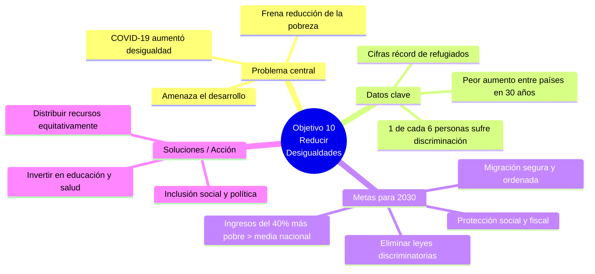

Buenos días. Hoy os voy a explicar el **Objetivo 10 de la Agenda 2030: Reducir las desigualdades** tanto dentro de los países como entre ellos.

La desigualdad por motivos de ingresos, género, edad, discapacidad u origen sigue persistiendo en todo el mundo. Es un problema grave porque amenaza el desarrollo a largo plazo y frena la reducción de la pobreza. Los datos oficiales son claros: **una de cada seis personas en el mundo** ha sufrido algún tipo de discriminación.

Aunque antes de la pandemia estábamos mejorando, el COVID-19 provocó el mayor aumento de desigualdad entre países de las últimas tres décadas. Además, nos enfrentamos a cifras récord de desplazados.

Para solucionar esto, el Objetivo 10 plantea metas muy concretas de aquí a 2030:

- Conseguir que los ingresos del **40% más pobre** crezcan por encima de la media nacional.
    
- Garantizar la igualdad de oportunidades **eliminando leyes y políticas discriminatorias**.
    
- Invertir en educación, salud y medidas de **protección social**.
    
- Facilitar una **migración segura**, regular y responsable.
    

En conclusión, el desarrollo sostenible es imposible si privamos a las personas de la oportunidad de tener una vida digna. Muchas gracias.
