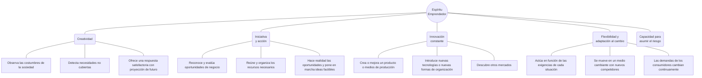
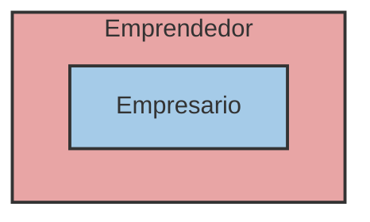

# Unidad 4: Habilidades emprendedoras e innovación

## 1. El emprendedor: creatividad e innovación

- El espíritu emprendedor está estrechamente ligado a la iniciativa y a la acción.
    
- Las personas dotadas de espíritu emprendedor son creativas, tienen capacidad innovadora y la voluntad de probar cosas nuevas o hacerlas de manera diferente.
    
- Innovar proporciona un valor añadido a la sociedad, ayuda a construir una sociedad más sostenible y mejora el bienestar de los individuos.

### Diferencia entre Emprendedor y Empresario

- «Emprendedor» y «empresario» no son lo mismo.
    
- El **empresario** es la persona que crea y dirige una empresa.
    
- El **emprendedor** es un concepto más amplio: se trata de la persona que inicia una acción creativa e innovadora.
    
- Ser emprendedor generalmente implica aceptar un riesgo y saber adaptarse a los cambios constantes de la sociedad.
    
- El empresario es un tipo de emprendedor, pero puede haber emprendedores en otras áreas como la política, la investigación o la Administración pública.

## 2. Las habilidades emprendedoras

### 2.1. Competencias personales y emocionales

- **Flexibilidad:** Consiste en saber adaptarse a los cambios y tener una mentalidad abierta que permita entender otras formas de pensar y actuar. El empresario trabaja en un entorno cambiante y competitivo, por lo que debe estar preparado para aprender y cambiar sus formas y métodos de trabajo.
    
- **Curiosidad:** El emprendedor se interesa por casi todo, observando el entorno y sus necesidades para renovarse constantemente a lo largo del tiempo.
    
- **Proactividad:** Significa tomar la iniciativa y asumir la responsabilidad de hacer que las cosas sucedan, decidiendo en cada momento lo que queremos hacer. Es la capacidad para subordinar los impulsos a los valores personales.
    
- **Capacidad de asumir riesgos:** Es la predisposición a actuar con decisión ante situaciones que requieren cierto arrojo por su dificultad. Implica ser consciente de que el riesgo es inherente a la vida y positivo para aprender tanto de los éxitos como de los fracasos.
    
- **Tolerancia a la frustración y la incertidumbre:** Es la necesidad de enfrentarse a problemas, retrasos, dificultades o imprevistos casi a diario. Requiere saber afrontar los obstáculos, gestionar los conflictos y perseverar aunque las cosas no salgan bien a la primera.
    
- **Resiliencia:** Es la capacidad personal para hacer frente a acontecimientos adversos y recuperar una vida normal. Incluye la determinación de ser capaz de hacer una cosa hasta finalizarla, incluso recibiendo fuertes presiones en contra.
**Otras cualidades personales del emprendedor:**

- Iniciativa.
    
- Creatividad e Innovación.
    
- Autonomía.
    
- Visión de futuro.
    
- Tenacidad y Responsabilidad.
    
- Sentido crítico.
    
- Autodisciplina.
    
- Confianza en sí misma.
    
- Motivación de logro.
    

### 2.2. Competencias sociales

- Habilidades comunicativas.
    
- Habilidades negociadoras.
    
- Espíritu de equipo y capacidad para el trabajo colaborativo (actitudes de cooperación).
    
- Asertividad.
    
- Capacidad de planificación, gestión y organización.
    
- Liderazgo.
# Conceptos
- **Iniciativa:** Todo aquello que hagas antes de que te lo pidan o que directamente no te lo vallan a pedir.
- **Autonomía:** Hacer las cosas por ti mismo y que no te lo tengan que decir.
- **Visión de futuro:** Ver que necesito para el futuro.
- **Tenacidad: ** Tener un objetivo que hasta no lo cumples no lo dejas.
- **Responsabilidad:** Valor para cumplir sus obligaciones, tomar decisiones de manera consciente y asumir las consecuencias de sus propios actos.
- **Sentido crítico:** Analizar lo que has hecho o lo que no y como lo has hecho, si está bien o está mal.
- **Autodisciplina:** Capacidad de controlar nuestras acciones, impulsos y emociones para cumplir metas a largo plazo.
- **Motivación de logro**: Tener ganas de llevar con éxito los propósitos.
- **Asertividad:** Habilidad social que permite expresar opiniones, deseos y necesidades de forma clara, honesta y respetuosa, sin caer en la pasividad ni en la agresividad (decir las cosas de buena manera).