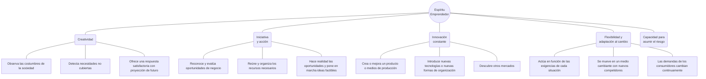
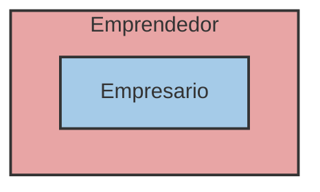
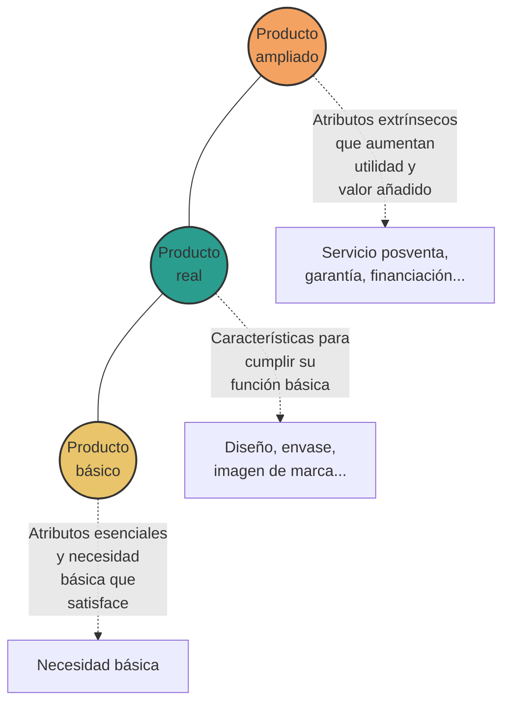
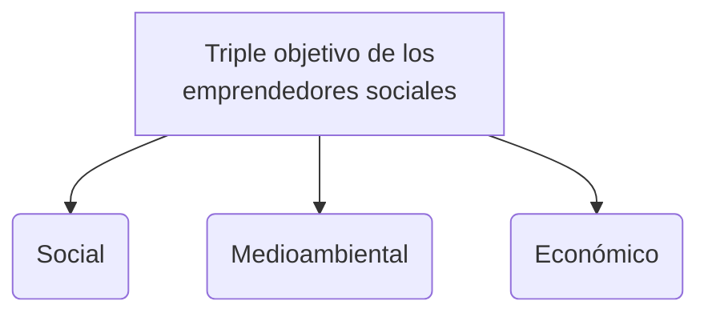

# Unidad 4: Habilidades emprendedoras e innovación

## 1. El emprendedor: creatividad e innovación

- El espíritu emprendedor está estrechamente ligado a la iniciativa y a la acción.
    
- Las personas dotadas de espíritu emprendedor son creativas, tienen capacidad innovadora y la voluntad de probar cosas nuevas o hacerlas de manera diferente.
    
- Innovar proporciona un valor añadido a la sociedad, ayuda a construir una sociedad más sostenible y mejora el bienestar de los individuos.

### Diferencia entre Emprendedor y Empresario

- «Emprendedor» y «empresario» no son lo mismo.
    
- El **empresario** es la persona que crea y dirige una empresa.
    
- El **emprendedor** es un concepto más amplio: se trata de la persona que inicia una acción creativa e innovadora.
    
- Ser emprendedor generalmente implica aceptar un riesgo y saber adaptarse a los cambios constantes de la sociedad.
    
- El empresario es un tipo de emprendedor, pero puede haber emprendedores en otras áreas como la política, la investigación o la Administración pública.

## 2. Las habilidades emprendedoras

### 2.1. Competencias personales y emocionales

- **Flexibilidad:** Consiste en saber adaptarse a los cambios y tener una mentalidad abierta que permita entender otras formas de pensar y actuar. El empresario trabaja en un entorno cambiante y competitivo, por lo que debe estar preparado para aprender y cambiar sus formas y métodos de trabajo.
    
- **Curiosidad:** El emprendedor se interesa por casi todo, observando el entorno y sus necesidades para renovarse constantemente a lo largo del tiempo.
    
- **Proactividad:** Significa tomar la iniciativa y asumir la responsabilidad de hacer que las cosas sucedan, decidiendo en cada momento lo que queremos hacer. Es la capacidad para subordinar los impulsos a los valores personales.
    
- **Capacidad de asumir riesgos:** Es la predisposición a actuar con decisión ante situaciones que requieren cierto arrojo por su dificultad. Implica ser consciente de que el riesgo es inherente a la vida y positivo para aprender tanto de los éxitos como de los fracasos.
    
- **Tolerancia a la frustración y la incertidumbre:** Es la necesidad de enfrentarse a problemas, retrasos, dificultades o imprevistos casi a diario. Requiere saber afrontar los obstáculos, gestionar los conflictos y perseverar aunque las cosas no salgan bien a la primera.
    
- **Resiliencia:** Es la capacidad personal para hacer frente a acontecimientos adversos y recuperar una vida normal. Incluye la determinación de ser capaz de hacer una cosa hasta finalizarla, incluso recibiendo fuertes presiones en contra.
**Otras cualidades personales del emprendedor:**

- Iniciativa.
    
- Creatividad e Innovación.
    
- Autonomía.
    
- Visión de futuro.
    
- Tenacidad y Responsabilidad.
    
- Sentido crítico.
    
- Autodisciplina.
    
- Confianza en sí misma.
    
- Motivación de logro.
    

### 2.2. Competencias sociales

- Habilidades comunicativas.
    
- Habilidades negociadoras.
    
- Espíritu de equipo y capacidad para el trabajo colaborativo (actitudes de cooperación).
    
- Asertividad.
    
- Capacidad de planificación, gestión y organización.
    
- Liderazgo.
# Conceptos
- **Iniciativa:** Todo aquello que hagas antes de que te lo pidan o que directamente no te lo vallan a pedir.
- **Autonomía:** Hacer las cosas por ti mismo y que no te lo tengan que decir.
- **Visión de futuro:** Ver que necesito para el futuro.
- **Tenacidad: ** Tener un objetivo que hasta no lo cumples no lo dejas.
- **Responsabilidad:** Valor para cumplir sus obligaciones, tomar decisiones de manera consciente y asumir las consecuencias de sus propios actos.
- **Sentido crítico:** Analizar lo que has hecho o lo que no y como lo has hecho, si está bien o está mal.
- **Autodisciplina:** Capacidad de controlar nuestras acciones, impulsos y emociones para cumplir metas a largo plazo.
- **Motivación de logro**: Tener ganas de llevar con éxito los propósitos.
- **Asertividad:** Habilidad social que permite expresar opiniones, deseos y necesidades de forma clara, honesta y respetuosa, sin caer en la pasividad ni en la agresividad (decir las cosas de buena manera).

## 3. El intraemprendedor

- Las cualidades del emprendedor se pueden desarrollar en diversos ámbitos de la vida y en diferentes ambientes laborales, ya sea trabajando por cuenta ajena o como funcionario.
    
- **El intraemprendedor** es una persona que, trabajando por cuenta ajena, desarrolla y lleva a cabo proyectos de otros, con el mismo espíritu de innovación, creatividad y autonomía que si fueran propios.
    
- Transforma una idea en un proyecto realizable y persigue los mismos objetivos de la organización.
    

## 4. El concepto y el proceso de innovación

- La **innovación** hace referencia a la acción o al proceso de generar cambios significativos en cualquier elemento, que produzca la creación de uno nuevo o lo transforme de manera importante.
    
- En términos empresariales está asociado a un aumento de la rentabilidad.
    

### Tipos de innovación y su interrelación

- **Innovación de producto:** Se produce cuando aparece un nuevo bien o servicio en el mercado, o cuando se han mejorado de forma significativa sus propiedades, la forma de utilizarse, las características técnicas, los componentes o sus materiales.
    
- **Innovación de proceso:** Consiste en utilizar nuevos o mejorados procesos de fabricación, logística o distribución de los productos. Lo que experimenta una mejora significativa no es el producto en sí, sino la manera de obtenerlo.
    
- **Innovación en organización:** Cambios en los procedimientos de la empresa o en la organización del trabajo (en la gestión del sistema de calidad, en el almacén, en la formación y evaluación de los RR. HH., gestión del medioambiente, etc.).
    
- **Innovación de marketing:** Utilización de un método de comercialización no empleado antes en la empresa, que puede consistir en cambios de diseño, envasado, posicionamiento, promoción o tarificación, y cuyo objetivo será siempre incrementar las ventas.
    

### Niveles del producto en la innovación

En la innovación de producto se pueden tener en cuenta los diversos componentes de un producto, ya que se puede innovar en cada uno de ellos:

1. **Producto ampliado:** Son los atributos extrínsecos al producto que aumentan su utilidad y proporcionan un valor añadido: servicio posventa, garantía, financiación, entrega y servicio a domicilio, instalación, ventajas del producto respecto a la competencia.
    
2. **Producto real:** Son las características del producto que permiten que cumpla su función básica: diseño, envase, imagen de marca, nivel de calidad.
    
3. **Producto básico:** Son los atributos esenciales del producto y la necesidad básica que satisface.

## 5. El valor del emprendimiento para la sociedad

### 5.1 Bienestar social

Uno de los principales objetivos de la empresa es la obtención de un beneficio económico, pero también realiza una serie de funciones de utilidad para la sociedad, promoviendo su bienestar:

- **Identifica las necesidades** de la sociedad y ofrece un bien o servicio que las atienda de forma satisfactoria.
    
- **Contribuye al progreso tecnológico.** Con la llegada de nueva competencia, las empresas se ven obligadas a mejorar cada vez más el producto que ofrecen, mejorando así los productos con el tiempo.
    
- **Contrata trabajadores y crea empleo**.
    
- **Crea y redistribuye riqueza.** Al remunerar al personal, aumenta su poder adquisitivo, permitiendo el consumo y contribuyendo al desarrollo del entorno.
    

### 5.2. Los emprendedores sociales. Sostenibilidad y cuidado del medioambiente

- **Los emprendedores sociales** son aquellos que crean una empresa para solucionar un problema social existente, de forma rentable y sostenida en el tiempo.
    
- Descubren una oportunidad de negocio que contribuye a mejorar la sociedad; aprovechan la actividad empresarial para transformar una realidad social.
    
- Tienen un **triple objetivo**, que desean conseguir de forma sostenida a lo largo del tiempo:
    
    1. Social.
        
    2. Medioambiental.
        
    3. Económico.
        
- La **sostenibilidad** se refiere a la satisfacción de las necesidades actuales sin comprometer la capacidad de las generaciones futuras de satisfacer las suyas, garantizando el equilibrio entre crecimiento económico, cuidado del medio ambiente y bienestar social.

### 5.3 La Agenda 2030

- En 2015, la ONU aprobó la Agenda 2030 sobre el Desarrollo Sostenible, una oportunidad para que los países emprendan un nuevo camino con el que mejorar la vida de todos, sin excluir a nadie.
    
- Su finalidad es erradicar la pobreza, proteger el planeta y garantizar que todas las personas disfruten de paz y prosperidad.