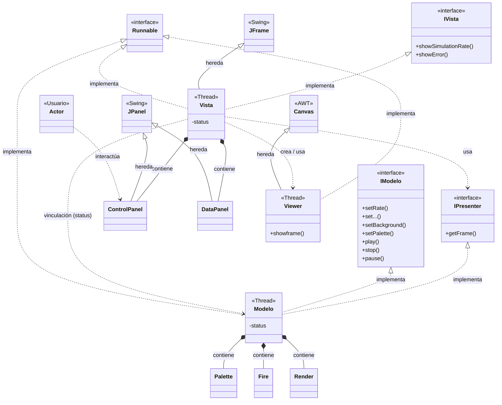

```mermaid title:""
classDiagram
    %% Fuerza la dirección del diagrama de Arriba hacia Abajo
    direction TB

    %% --- 1. NIVEL SUPERIOR: INTERFACES ---
    class IVista {
        <<interface>>
        +showSimulationRate()
        +showError()
    }
    class IPresenter {
        <<interface>>
        +getFrame()
    }
    class IModelo {
        <<interface>>
        +setRate()
        +set...()
        +setBackground()
        +setPalette()
        +play()
        +stop()
        +pause()
    }
    
    %% --- 2. CLASES EXTERNAS / LIBRERÍAS ---
    class JFrame {
        <<Swing>>
    }
    class JPanel {
        <<Swing>>
    }
    class Runnable {
        <<interface>>
    }
    class Canvas {
        <<AWT>>
    }

    %% --- 3. NIVEL MEDIO: CLASES PRINCIPALES (Hilos) ---
    class Vista {
        <<Thread>>
        -status
    }
    class Modelo {
        <<Thread>>
        -status
    }

    %% --- 4. NIVEL INFERIOR: COMPONENTES ---
    class ControlPanel
    class DataPanel
    class Palette
    class Fire
    class Render
    class Viewer {
        <<Thread>>
        +showframe()
    }
    class Actor {
        <<Usuario>>
    }

    %% ==========================================
    %% RELACIONES ESTRUCTURADAS (Para forzar el layout)
    %% ==========================================

    %% Herencias e implementaciones principales
    IVista <|.. Vista : implementa
    IPresenter <|.. Modelo : implementa
    IModelo <|.. Modelo : implementa
    JFrame <|-- Vista : hereda

    %% Dependencias del Presentador/Vista
    Vista ..> IPresenter : usa
    Vista ..> Modelo : vinculación (status)

    %% Implementación de Hilos (Runnable)
    Runnable <|.. Vista : implementa
    Runnable <|.. Modelo : implementa
    Runnable <|.. Viewer : implementa

    %% Composiciones hacia los paneles de la Vista
    Vista *-- ControlPanel : contiene
    Vista *-- DataPanel : contiene
    
    %% Herencia de los paneles hacia JPanel
    JPanel <|-- ControlPanel : hereda
    JPanel <|-- DataPanel : hereda

    %% Composiciones del Modelo (Motor de Doomfire)
    Modelo *-- Palette : contiene
    Modelo *-- Fire : contiene
    Modelo *-- Render : contiene

    %% Viewer y sus dependencias
    Vista ..> Viewer : crea / usa
    Canvas <|-- Viewer : hereda

    %% Actor interactuando con el Panel de Control
    Actor ..> ControlPanel : interactúa
```