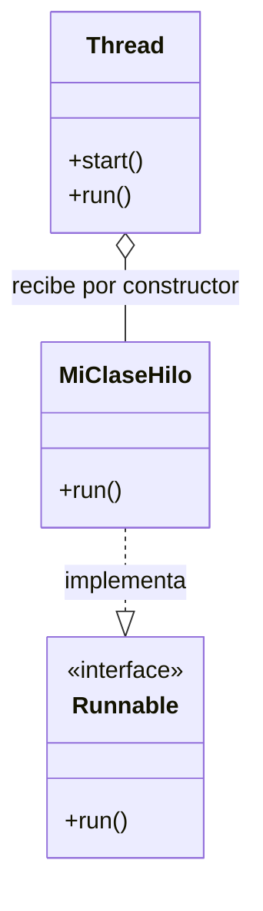
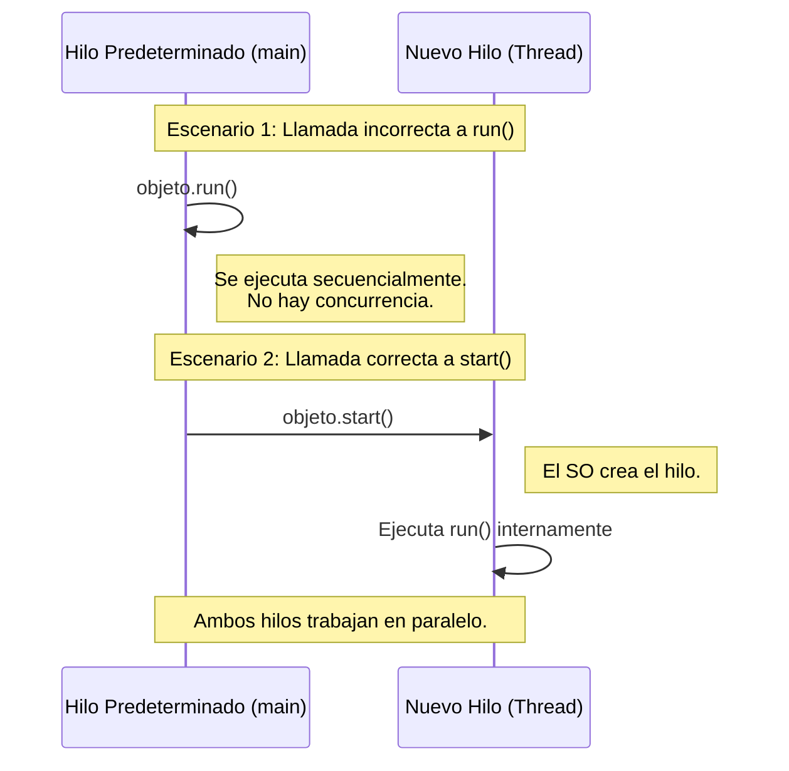
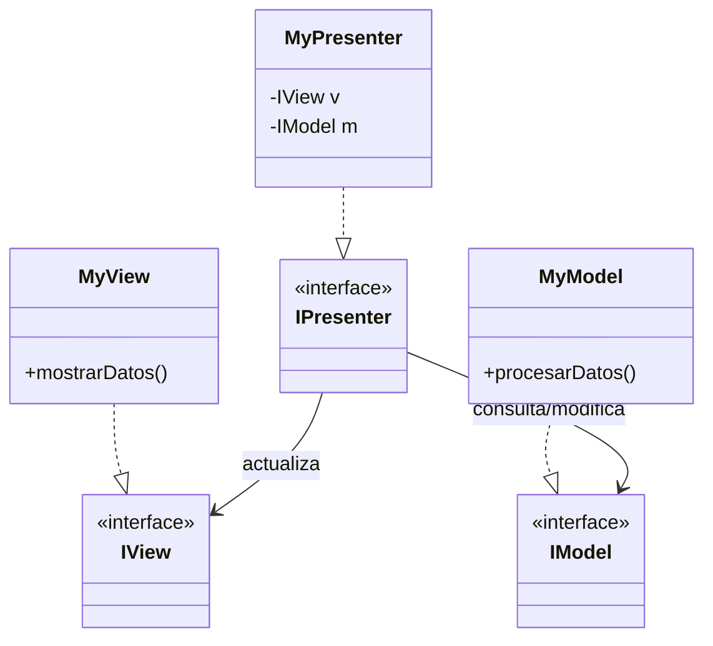
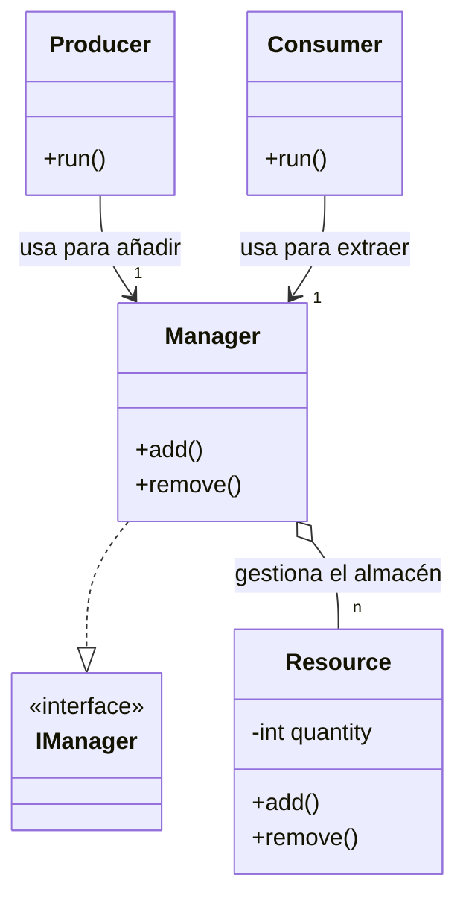

# 🧵 Hilos (Threads) en Java

> [!abstract] Concepto Principal
> Un **hilo (thread)** es una línea de ejecución dentro de un proceso, lo que permite que un programa realice múltiples tareas al mismo tiempo. En Java, todo programa tiene un **hilo predeterminado** (creado automáticamente) que es el encargado de ejecutar el método `main`.

## 🏗️ Creación de Hilos

> [!info] La limitación estructural de Java
> Java **no soporta la herencia múltiple**. Esto condiciona enormemente la arquitectura al momento de crear hilos.

Existen dos vías para implementarlos:

1. **Heredar de la clase `Thread`: (Extendido)** Si tu clase hereda de `Thread`, ya no podrá heredar de ninguna otra clase, limitando el diseño.
2. **Implementar la interfaz `Runnable` (Recomendado):** Deja libre la herencia de clases. Obliga a implementar el método `run()` y requiere inyectar el objeto en el constructor de un `Thread`.


## ⚠️ El Peligro: `start()` vs `run()`

El código con las instrucciones que el hilo debe procesar va obligatoriamente dentro del método `run()` con la anotación `@Override`.

> [!danger] REGLA DE ORO DE LA CONCURRENCIA 
> **SI NO HAY `start()`, NO HAY HILO**.

- ❌ **Llamar a `run()` directamente:** El código se ejecuta igual, pero de manera secuencial en el hilo actual (ej. el del `main`). **No se crea un hilo paralelo**.
    
- ✅ **Llamar a `start()`:** El sistema operativo genera un hilo nuevo independiente y este invoca automáticamente al método `run()`.

## ⏱️ Rendimiento y Ciclo de Vida

> [!warning] Sobrecarga del Sistema (Overhead) 
> Crear hilos es un proceso costoso que consume recursos del procesador y memoria .

- **Mala práctica:** Crear hilos masivamente para tareas minúsculas (ej. una operación de un nanosegundo) . El coste de creación satura la aplicación porque tarda más en crearse que en ejecutarse .
    
- **Buena práctica:** Utilizarlos para tareas de cierta duración o procesos continuos (como bucles infinitos para mantener tareas de fondo activas) .
    

> [!tip] Fin de la ejecución Un hilo finaliza su ciclo de vida y se destruye automáticamente en el momento en que terminan de ejecutarse las líneas de código contenidas en su método `run()` .

## 🏗️ Arquitectura MVP (Model-View-Presenter)

> [!abstract] El Patrón MVP 
> El patrón **Model-View-Presenter (MVP)** es una evolución de MVC diseñada para lograr una estricta separación entre la lógica de negocio y la interfaz de usuario. Es un estándar en muchas aplicaciones que requieren interfaces limpias y testables.

- **Model (Modelo):** Contiene la lógica de negocio, reglas y el acceso a los datos.
    
- **View (Vista):** Es la interfaz gráfica (UI). **Su regla fundamental es que no contiene lógica de negocio**. Solo se encarga de mostrar información y capturar eventos del usuario.
    
- **Presenter (Presentador):** Es el "cerebro" intermediario. Recibe eventos de la Vista, actualiza el Modelo y, en respuesta, indica a la Vista cómo debe actualizarse.
    

### Desacoplamiento mediante Interfaces

> [!info] Diseño por Contratos 
> Para lograr un verdadero desacoplamiento, la arquitectura exige el uso de **interfaces**. Ninguna capa conoce la implementación real de la otra.

El sistema se estructura mediante contratos:

- **`IView`:** Interfaz que define las acciones visuales. Es implementada por la clase concreta de la interfaz (ej. `MyView`).
    
- **`IModel`:** Interfaz que define las operaciones de negocio. Es implementada por el modelo concreto (ej. `MyModel`).
    
- **`IPresenter`:** Interfaz que define los flujos de control. Es implementada por el presentador (ej. `MyPresenter`).
    

> [!tip] Regla de Dependencia 
> El Presentador recibe instancias de las interfaces (`IView` e `IModel`), por lo que desconoce los detalles concretos de `MyView` o `MyModel`.



### Inicialización e Inyección de Dependencias

El ensamblaje de las piezas (inyección de dependencias) no debe ocurrir dentro de las propias clases, sino en un nivel superior (como el `main` o una clase ensambladora):
```java title:"Inicialización e Inyección de Dependencias"
// Se instancian las implementaciones concretas
IView v = new MyView();
IModel m = new MyModel();

// Se inyectan en el presentador a través del constructor
IPresenter p = new MyPresenter(v, m);
```
## 🚗 Relaciones de Clases: Agregación

> [!abstract] Agregación 
> La agregación es una relación estructural donde un objeto "tiene un" conjunto de otros objetos. Por ejemplo, un coche (`Car`) tiene ruedas (`Wheel`).

En la práctica, la clase contenedora posee una estructura de datos (como un `Array` o un `ArrayList`) que almacena referencias a los objetos contenidos.

**Ejemplo: Un coche y sus ruedas**

La clase `Car` gestiona objetos `Wheel` internos, ofreciendo métodos de conveniencia para interactuar con ellos sin exponer directamente la estructura de datos:

- `addWheel(Wheel w)`: Añade una nueva rueda a la colección del coche.
    
- `setWheel(Wheel w, int index)`: Reemplaza o asigna una rueda en una posición concreta.
    
- `getPressure()`: Recorre las ruedas internas para devolver información sobre su estado (ej. presión).
    
- `getWeight()`: Calcula el peso total del vehículo.
```java title:"Ejemplo coche"
Car c = new Car();

// Se instancian las ruedas de forma independiente
Wheel w1 = new Wheel();
Wheel w2 = new Wheel();
Wheel w3 = new Wheel();
Wheel w4 = new Wheel();

// Se agregan al objeto contenedor
c.addWheel(w1);
// ...
```
## ⚙️ Hilos y Modificación de la UI

> [!warning] El problema de la interfaz gráfica 
> Las interfaces gráficas en Java (como Swing) manejan sus actualizaciones en un hilo exclusivo (el _Event Dispatch Thread_). Si creas un hilo secundario e intentas modificar un botón o texto directamente desde él, pueden ocurrir errores de sincronización o bloqueos.

### Solución: Clases Internas Anónimas

Para facilitar la interacción entre un hilo secundario y la vista, es común definir el hilo utilizando **clases internas anónimas** (o lambdas) directamente dentro de la clase de la Vista.

Al hacer esto, el código del hilo (el método `run()`) hereda automáticamente el contexto léxico y **tiene acceso directo** a los atributos y métodos de la UI.
```java title:"Clase Interna Anónima"
// Dentro de la clase MyView
Thread miHilo = new Thread(new Runnable() {
    @Override
    public void run() {
        // Al ser una clase interna, este hilo "ve" los componentes de la vista
        miBoton.setText("Procesando...");
        actualizarBarraDeProgreso();
    }
});
miHilo.start();
```
## 🔄 Simulación: Productor - Consumidor

> [!abstract] Sincronización Clásica 
> El patrón Productor-Consumidor es un problema fundamental de la concurrencia. Consiste en coordinar procesos que generan datos con procesos que los consumen, compartiendo un recurso limitado.

El escenario involucra cuatro actores principales:

- **Productor (Producer - P):** Un hilo que genera un recurso y lo inserta en el sistema.
    
- **Consumidor (Consumer - C):** Un hilo que extrae un recurso del sistema para procesarlo.
    
- **Recurso (Resource - R):** La unidad de datos (o tarea) que se comparte.
    
- **Gestor (Manager - M):** El núcleo del patrón. Es un monitor o controlador centralizado que expone métodos para que los productores añadan y los consumidores retiren recursos.
    

### La importancia de la sincronización

El Gestor (`Manager`) debe implementar mecanismos de exclusión mutua (por ejemplo, con la palabra clave `synchronized`) en métodos como `add()` y `remove()`. Esto evita **condiciones de carrera**:

- Bloquea al Consumidor si intenta hacer `remove()` y no hay recursos disponibles.
    
- Bloquea al Productor si intenta hacer `add()` y el búfer o almacén está lleno.

