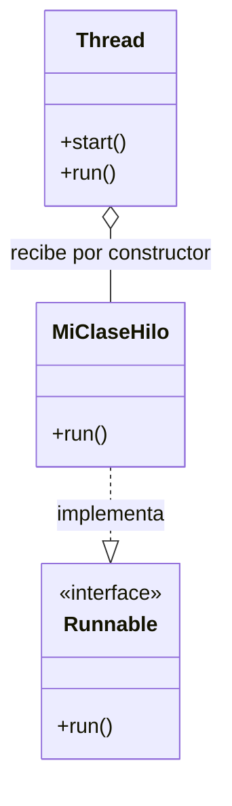
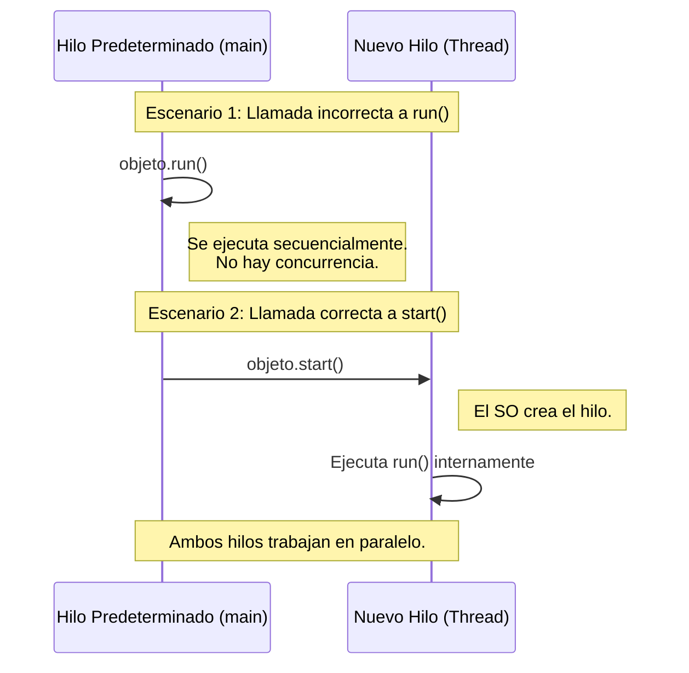

# 🧵 Hilos (Threads) en Java

> [!abstract] Concepto Principal
> Un **hilo (thread)** es una línea de ejecución dentro de un proceso, lo que permite que un programa realice múltiples tareas al mismo tiempo. En Java, todo programa tiene un **hilo predeterminado** (creado automáticamente) que es el encargado de ejecutar el método `main`.

## 🏗️ Creación de Hilos

> [!info] La limitación estructural de Java
> Java **no soporta la herencia múltiple**. Esto condiciona enormemente la arquitectura al momento de crear hilos.

Existen dos vías para implementarlos:

1. **Heredar de la clase `Thread`: (Extendido)** Si tu clase hereda de `Thread`, ya no podrá heredar de ninguna otra clase, limitando el diseño.
2. **Implementar la interfaz `Runnable` (Recomendado):** Deja libre la herencia de clases. Obliga a implementar el método `run()` y requiere inyectar el objeto en el constructor de un `Thread`.

## ⚠️ El Peligro: `start()` vs `run()`

El código con las instrucciones que el hilo debe procesar va obligatoriamente dentro del método `run()` con la anotación `@Override`.

> [!danger] REGLA DE ORO DE LA CONCURRENCIA **SI NO HAY `start()`, NO HAY HILO**.

- ❌ **Llamar a `run()` directamente:** El código se ejecuta igual, pero de manera secuencial en el hilo actual (ej. el del `main`). **No se crea un hilo paralelo**.
    
- ✅ **Llamar a `start()`:** El sistema operativo genera un hilo nuevo independiente y este invoca automáticamente al método `run()`.

## ⏱️ Rendimiento y Ciclo de Vida

> [!warning] Sobrecarga del Sistema (Overhead) Crear hilos es un proceso costoso que consume recursos del procesador y memoria .

- **Mala práctica:** Crear hilos masivamente para tareas minúsculas (ej. una operación de un nanosegundo) . El coste de creación satura la aplicación porque tarda más en crearse que en ejecutarse .
    
- **Buena práctica:** Utilizarlos para tareas de cierta duración o procesos continuos (como bucles infinitos para mantener tareas de fondo activas) .
    

> [!tip] Fin de la ejecución Un hilo finaliza su ciclo de vida y se destruye automáticamente en el momento en que terminan de ejecutarse las líneas de código contenidas en su método `run()` .