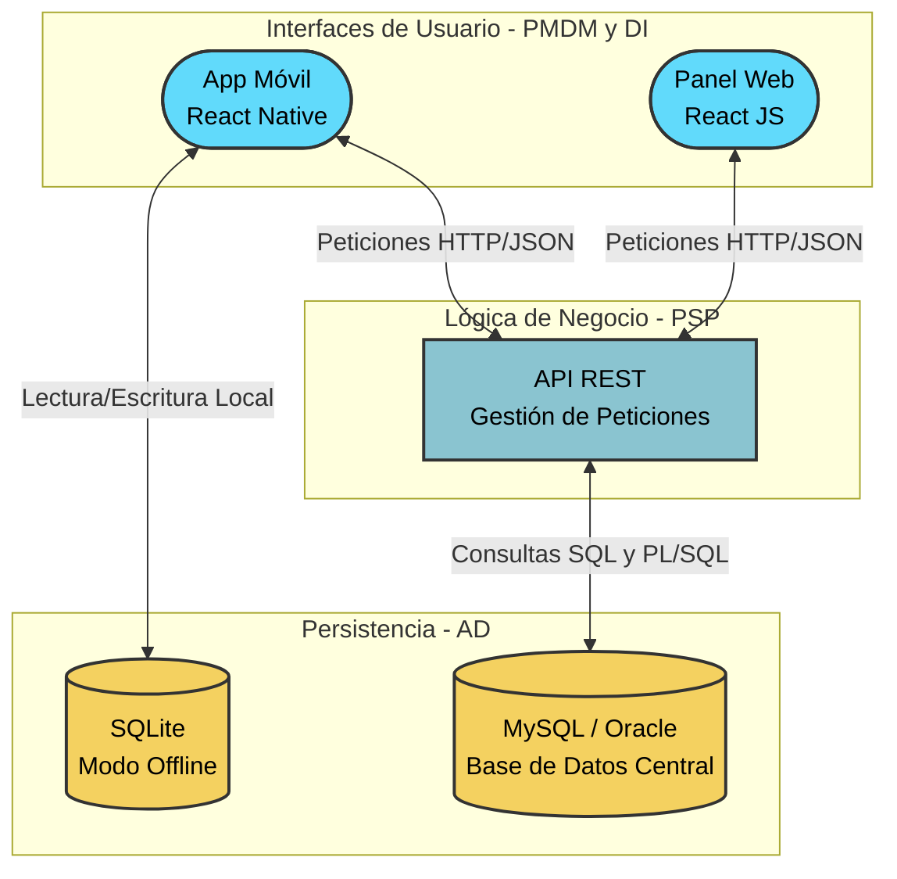

## 1. App Android de Mantenimiento y Documentación de Vehículos

**1. PMDM (Programación Multimedia y Dispositivos Móviles)**

- **Desarrollo:** App desarrollada con React Native (puedes usar Expo para facilitar las pruebas directamente en tu móvil o CLI nativo).
    
- **Funcionalidades:** Uso de la cámara del dispositivo a través de librerías (como `expo-camera`) para escanear facturas del taller, navegación con React Navigation y gestión del estado (con Context API o Redux) para manejar los datos.
    

**2. DI (Desarrollo de Interfaces)**

- **Desarrollo:** Como ya tocáis React, el panel de administración para ordenador (para ver gráficos de gastos, mantenimientos, etc.) lo puedes hacer con React JS (web) usando bibliotecas de componentes como Material-UI o Tailwind CSS.
    
- **Ventaja:** Al usar React en la web y React Native en el móvil, puedes llegar a compartir lógica o mantener una estructura de código casi idéntica en ambos lados.
    

**3. AD (Acceso a Datos)**

- **Local (Móvil):** En lugar de Room, en React Native utilizarías librerías como `expo-sqlite` o `react-native-sqlite-storage` para guardar los reportajes y mantenimientos de forma local cuando estés en el garaje sin cobertura.
    
- **Remoto (Servidor):** Tu base de datos relacional principal (MySQL u Oracle), manteniendo toda la lógica pesada (procedimientos PL/SQL para estadísticas anuales, disparadores).
    

**4. PSP (Programación de Servicios y Procesos)**

- **Backend:** Una API RESTful que sirva de puente entre tus aplicaciones (la de React Native y la web en React) y la base de datos remota. Si en el ciclo utilizáis Java, Spring Boot es el estándar; si os dan libertad, hacer el backend con Node.js (Express o NestJS) cerraría el círculo usando JavaScript/TypeScript en todo el proyecto.
    
- **Seguridad:** Implementación de tokens JWT para que solo tú (o usuarios autorizados) podáis acceder a los datos de los vehículos.

## 2. Panel Multiplataforma para Administración de Servidores (Minecraft)

Esta idea transforma la gestión por consola de servidores (como entornos Paper con múltiples plugins) en una plataforma visual y centralizada.

- **PMDM (React Native):** Aplicación móvil enfocada en la monitorización en tiempo real. Gráficos de consumo de RAM, medición de TPS (útil para detectar lag en el Overworld) y una terminal de comandos integrada para gestionar usuarios (kick/ban) o reiniciar el servidor desde el móvil.
    
- **DI (React JS):** Un panel de control web completo. Interfaz drag-and-drop para instalar y actualizar plugins (EssentialsX, LuckPerms, WorldGuard) y un editor visual para modificar los archivos YAML de configuración sin tocar la terminal.
    
- **PSP (Backend y Procesos):** API REST (Node.js o Spring Boot) que actúe como puente. Uso de procesos en segundo plano para ejecutar copias de seguridad automáticas del mundo, y gestión de conexiones SSH/RCON para comunicarse con el servidor físico o el hosting.
    
- **AD (Acceso a Datos):** Base de datos relacional (MySQL/Oracle) para almacenar logs centralizados, métricas históricas de rendimiento y estadísticas de jugadores.
    
- **SGE (Sistemas de Gestión):** Implementación de un sistema de alertas mediante webhooks (ej. notificaciones a Discord si el servidor se cae) o un módulo de facturación simulado que calcule el coste del hosting basado en el consumo de recursos.
    

## 3. Plataforma de Logística de Viajes para Mascotas

Un sistema diseñado para resolver la logística de trasladar animales en trayectos complejos que combinan barco y coche (por ejemplo, desde Mallorca hasta Salamanca).

- **PMDM (React Native):** Aplicación de viaje con modo offline prioritario (imprescindible para las horas en el ferry). Checklists de equipaje (transportines, medicación), recordatorios de comida durante el trayecto y acceso rápido a las cartillas veterinarias.
    
- **DI (React JS):** Plataforma web para la planificación previa. Gestión del perfil de los gatos, subida de documentos oficiales y un planificador visual de rutas con paradas aptas para animales.
    
- **PSP (Backend y Procesos):** Desarrollo de la API y programación de tareas asíncronas (cron jobs) que envíen notificaciones push automáticas cuando caduque una vacuna obligatoria para viajar o falten pocos días para el embarque.
    
- **AD (Acceso a Datos):** Uso de `expo-sqlite` en la app móvil para asegurar el acceso a los datos sin cobertura. En el servidor, MySQL/Oracle utilizando triggers para auditar cambios en los historiales médicos y PL/SQL para generar resúmenes clínicos.
    
- **SGE (Sistemas de Gestión):** Un generador de informes (como JasperReports o librerías PDF en Node) que compile un "Dossier de Embarque" con todos los certificados y billetes requeridos por las navieras, listo para imprimir o escanear.
    

## 4. Gestor de Conocimiento Técnico y Diagramado

Una herramienta de productividad orientada a programadores y estudiantes, enfocada en la metodología Zettelkasten y la generación automática de esquemas.

- **PMDM (React Native):** App móvil rápida para la captura de ideas. Escáner integrado que utilice la cámara para digitalizar apuntes a mano y convertirlos a texto, y visualizador de notas sincronizadas desde la nube.
    
- **DI (React JS):** Editor web avanzado de Markdown. Renderizado en tiempo real de diagramas Mermaid (como los de flujo o casos de uso) y fórmulas matemáticas en LaTeX. Interfaz de vista de grafo para ver las conexiones entre las distintas notas.
    
- **PSP (Backend y Procesos):** API encargada de la sincronización bidireccional entre los dispositivos. Procesamiento de archivos Markdown pesados utilizando hilos de ejecución separados para no bloquear las peticiones de red.
    
- **AD (Acceso a Datos):** Estructuración de las relaciones complejas entre notas (nodos y enlaces del Zettelkasten) dentro de una base de datos relacional estándar, aplicando reglas de normalización estrictas para evitar redundancia de etiquetas y metadatos.
    
- **SGE (Sistemas de Gestión):** Integración con APIs externas (como GitHub o GitLab) para hacer _commits_ automáticos de los apuntes a un repositorio de código, funcionando como un sistema de control de versiones documental.