---
tags:
  - recursos
  - DAM2
unidad: 1
tema: UML en Mermaid (Obsidian)
---
# UML en Mermaid (Obsidian)

## 1. Clases

### Clase completa
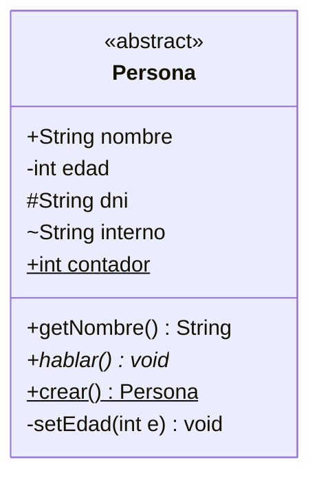

### Estereotipos
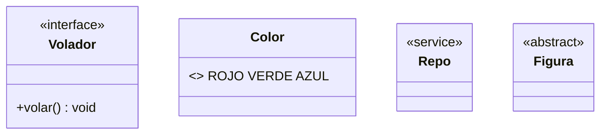

### Genéricos
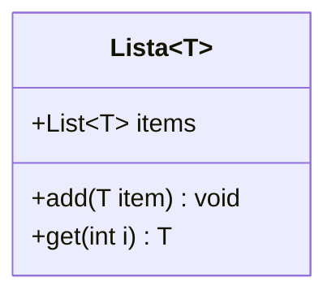

### Todas las relaciones
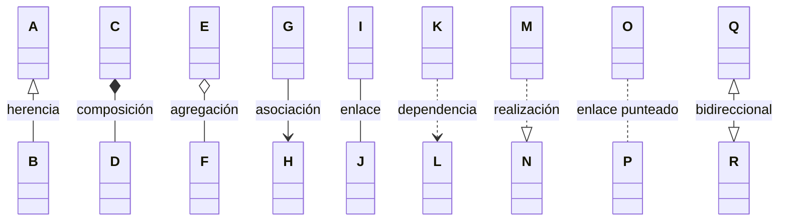

### Cardinalidad / multiplicidad
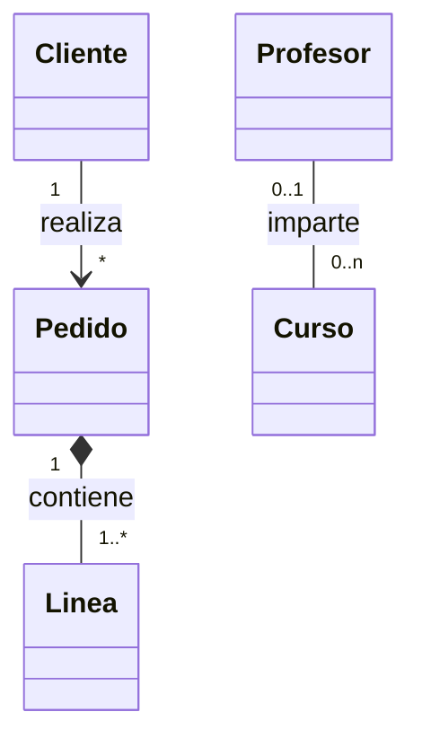

### Interfaz lollipop
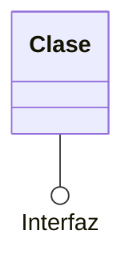

### Namespace (paquete)
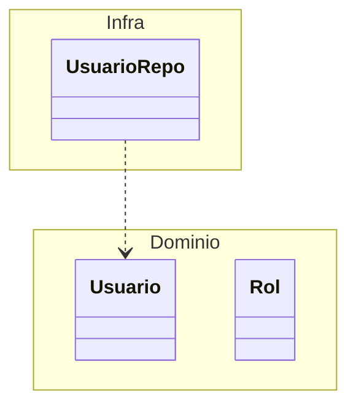

### Notas y dirección
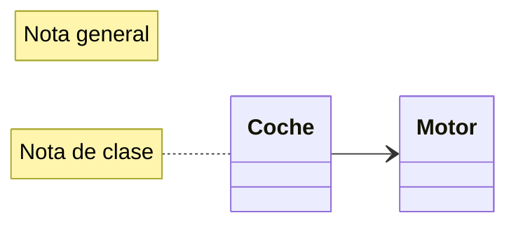

### Etiqueta de clase
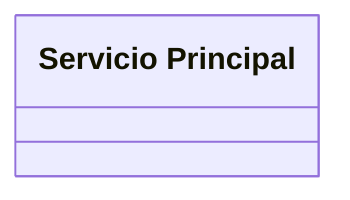

## 2. Objetos
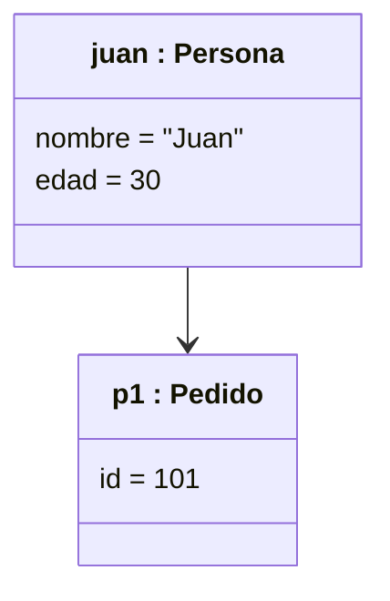

## 3. Secuencia

### Participantes y alias
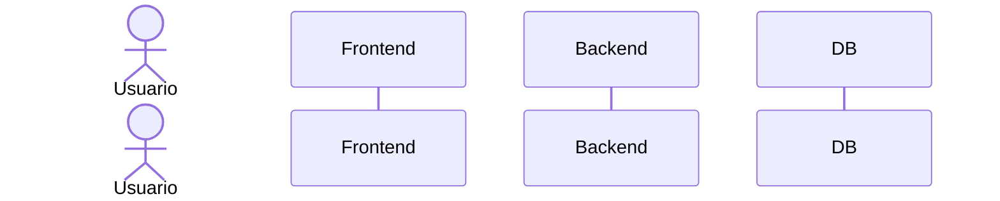

### Tipos de flecha
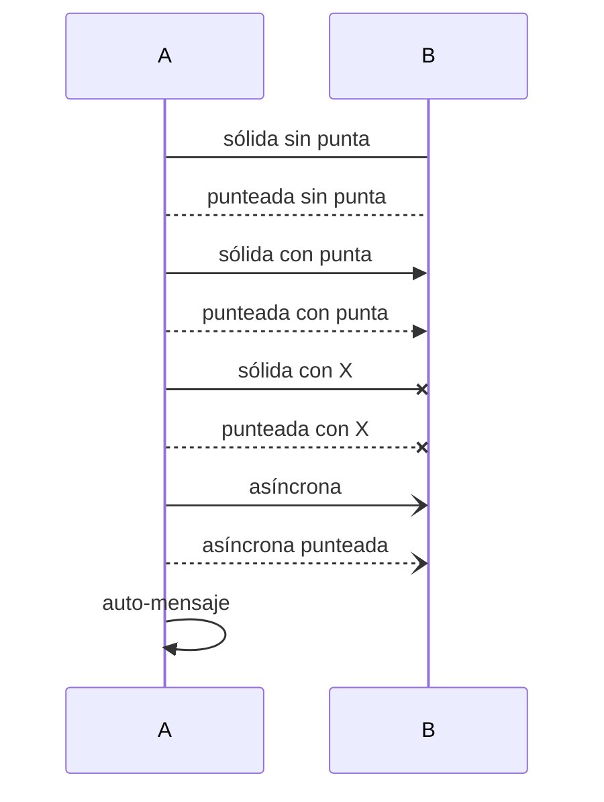

### Activación
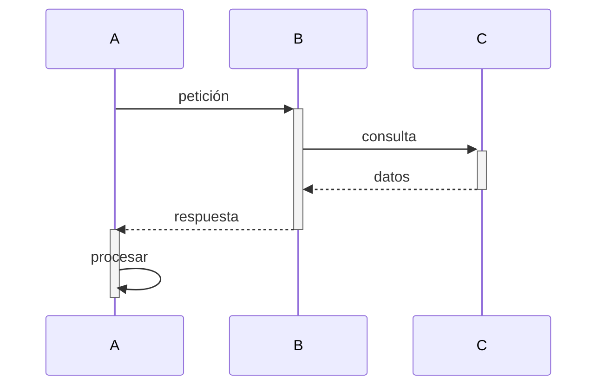

### Notas
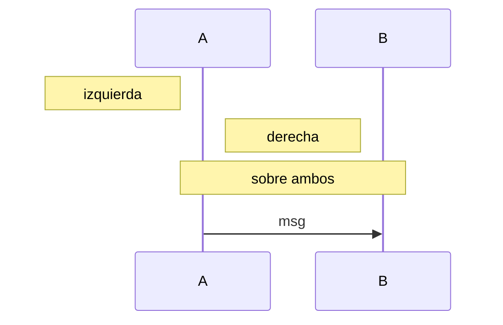

### Fragmentos combinados
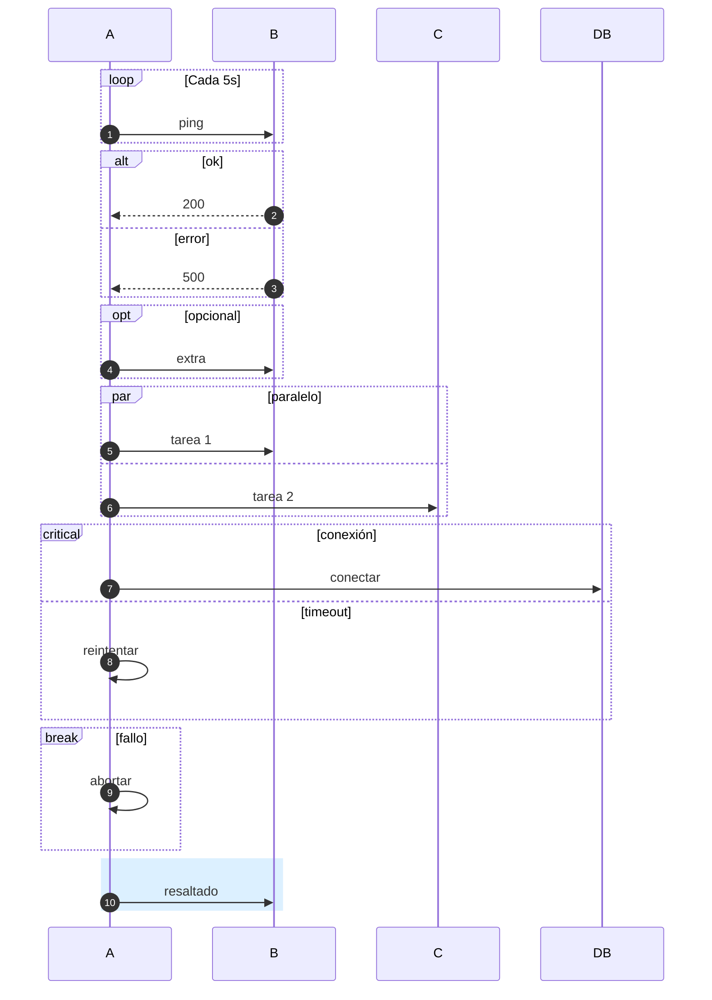

### Agrupar (box)
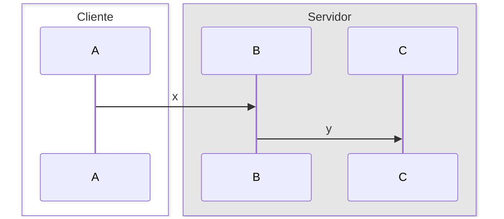

### Crear / destruir
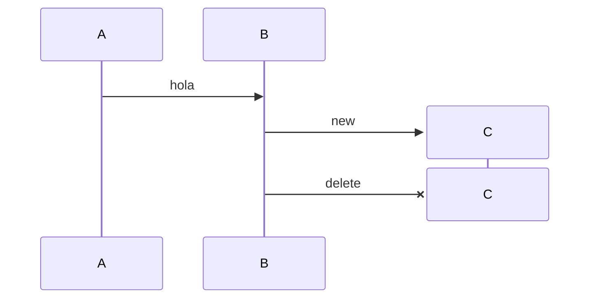

## 4. Estados

### Básico
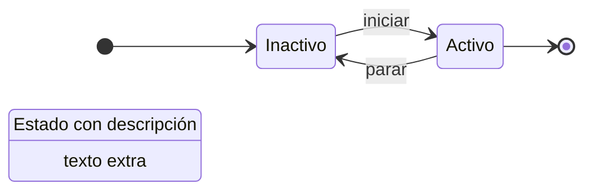

### Compuesto (anidado)
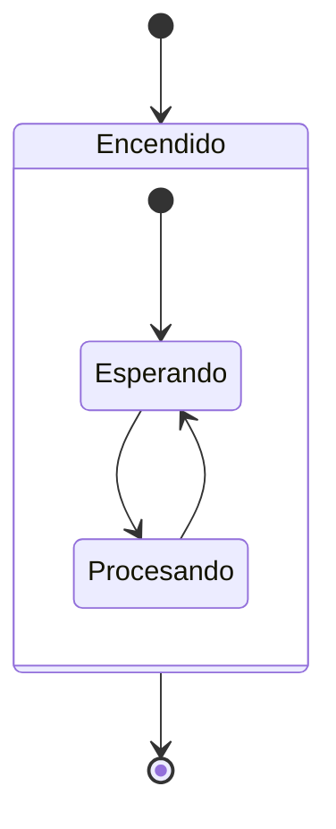

### Choice
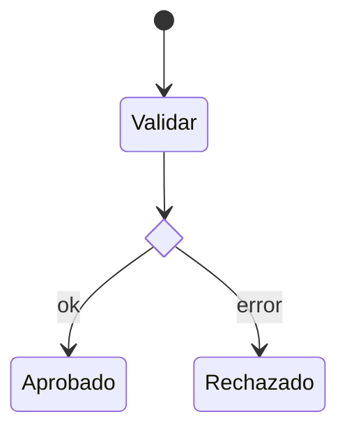

### Fork / Join
```mermaid
stateDiagram-v2
state f <<fork>>
state j <<join>>
[*] --> f
f --> A
f --> B
A --> j
B --> j
j --> [*]
```

### Concurrencia
```mermaid
stateDiagram-v2
[*] --> Activo
state Activo {
  [*] --> TecladoOn
  TecladoOn --> TecladoOff
  --
  [*] --> RatonOn
  RatonOn --> RatonOff
}
```

### Notas
```mermaid
stateDiagram-v2
A --> B
note right of A
  Nota multilínea
end note
note left of B : Nota corta
```

## 5. Actividad
```mermaid
flowchart TD
I((●)) --> A1([Recibir pedido])
A1 --> D{¿Stock?}
D -- Sí --> F1[" "]:::barra
D -- No --> A2([Notificar])
F1 --> A3([Empaquetar])
F1 --> A4([Facturar])
A3 --> J1[" "]:::barra
A4 --> J1
J1 --> M{ }
A2 --> M
M --> FIN(((◉)))
classDef barra fill:#000,stroke:#000
```

### Con carriles (swimlanes)
```mermaid
flowchart LR
subgraph Cliente
  C1([Pedir])
end
subgraph Tienda
  T1([Preparar]) --> T2([Enviar])
end
C1 --> T1
```

## 6. Casos de uso
```mermaid
flowchart LR
U["👤 Cliente"]
Adm["👤 Admin"]
subgraph Sistema
  UC1((Iniciar sesión))
  UC2((Comprar))
  UC3((Validar pago))
  UC4((Aplicar cupón))
  UC5((Gestionar))
end
U --- UC1
U --- UC2
Adm --- UC5
UC2 -. "«include»" .-> UC3
UC4 -. "«extend»" .-> UC2
Adm -->|generalización| U
```

## 7. Componentes
```mermaid
flowchart LR
subgraph App["«component» App"]
  UI[[UI]]
  API[[API]]
end
DB[("«component» BD")]
Ext[["«component» Pagos"]]
UI -->|usa| API
API -->|«interface» IRepo| DB
API -.->|REST| Ext
```

## 8. Despliegue
```mermaid
flowchart TB
subgraph N1["«device» Servidor Web"]
  subgraph E1["«execution env» Nginx"]
    W[["app.war"]]
  end
end
subgraph N2["«device» Servidor BD"]
  DB[("PostgreSQL")]
end
PC["«device» PC Cliente"]
PC -->|HTTPS| N1
N1 -->|TCP 5432| N2
```

## 9. Paquetes
```mermaid
flowchart TB
subgraph P1["📁 presentacion"]
  C1[Controlador]
end
subgraph P2["📁 negocio"]
  S1[Servicio]
end
subgraph P3["📁 datos"]
  R1[Repositorio]
end
P1 -. "«import»" .-> P2
P2 -. "«access»" .-> P3
```

## 10. Comunicación
```mermaid
flowchart LR
A[":Cliente"] -- "1: pedir()" --> B[":Tienda"]
B -- "2: comprobar()" --> C[":Almacén"]
B -- "3: cobrar()" --> D[":Pago"]
C -- "2.1: reservar()" --> C
```

## 11. Tiempo (aprox. con gantt)
```mermaid
gantt
dateFormat ss
axisFormat %S
section Semáforo
Rojo     :a1, 00, 10s
Verde    :a2, after a1, 8s
Ámbar    :a3, after a2, 3s
section Peatón
Espera   :b1, 00, 10s
Cruza    :b2, after b1, 8s
```

## 12. Estilos útiles
```mermaid
classDiagram
class A:::rojo
class B
A --> B
classDef rojo fill:#f99,stroke:#900
style B fill:#9cf
```